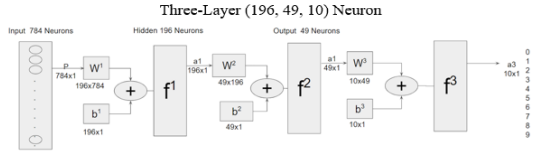
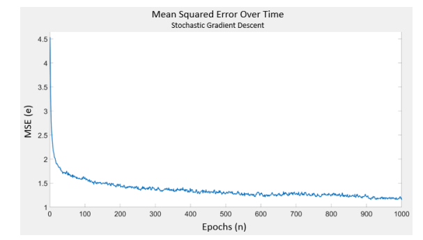

# Perceptron-Neural-Net

## Description

A Perceptron-based neural net structure written from the ground up in MATLAB to compete in Kaggle competition, taking first place.
Optimized through generalized batch training, image preprocessing, and variable learning rate.
Performs at a 89% mean accuracy classification rate, equal to the top 1% of MLP classifiers.

Three-layer (196,49,10 neuron) perceptron architecture

Mean-square-error over 1000 epochs for a stochastic-gradient descent trained
3-layer(196-49-10) network

## File List

BackpropagationANN.m : Main file containing backpropogation neural-net math.

ANN_Demo.m : Loads MNIST images, preprocesses image arrays, runs backprop. ANN functions and outputs results as graph.

ANN_Perceptron_Report.pdf : Report detailihng the methodology behind the neural net.

## Run

Download the MNIST fashion dataset [Source](https://www.kaggle.com/datasets/zalando-research/fashionmnist). Using preffered Mathlab 
